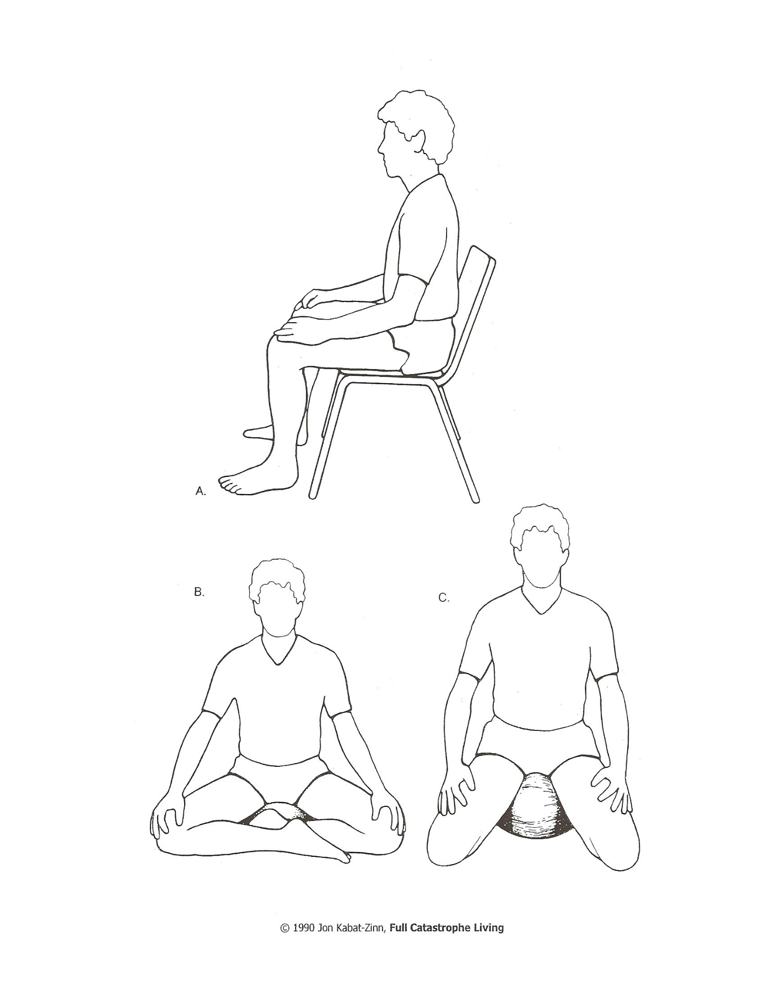

Sitting Meditation
==================

_from **Full Catastrophe Living** by Jon Kabat-Zinn_

[for audio guidance, go to [Sitting Meditation][1]]

We call the heart of the formal meditation practice “sitting meditation” or simply “sitting.” As
with breathing, sitting is not foreign to anyone. We all sit, nothing special about that. But
mindful sitting is different from ordinary sitting in the same way that mindful breathing is
different from ordinary breathing. The difference, of course, is your awareness.

To practice sitting, we make a special time and place for non-doing. We consciously adopt an
alert and relaxed body posture so that we can feel relatively comfortable without moving, and
then we reside with calm acceptance in the present without trying to fill it with anything. You
have already tried this in the various exercises in which you have watched your breathing.

It helps a lot to adopt an erect and dignified posture, with your head, neck, and back aligned
vertically. This allows the breath to flow most easily. It is also the physical counterpart of the
inner attitudes of self-reliance, self-acceptance, and alert attention that we are cultivating.

We usually practice the sitting meditation either on a chair or on the floor. If you choose a
chair, the ideal is to use one that has a straight back and that allows your feet to be flat on the
floor. We often recommend that if possible you sit away from the back of the chair so that you
spine is self-supporting (see Figure A). But if you have to, leaning against the back of the chair
is also fine. If you choose to sit on the floor, do so on firm, thick cushion which raises your
buttocks off the floor three to six inches (a pillow folded over once or twice does nicely; or you
can purchase a meditation cushion, or zafu, specifically for sitting).

There are a number of cross-legged sitting postures and kneeling postures that some people
use when they sit on the floor. The one I use most is the so-called “Burmese” posture (see
Figure B), which involves drawing one heel in close to the body and draping the other leg in
front of it. Depending on how flexible your hips and knees and ankles are, your knees may or
may not be touching the floor. It is somewhat more comfortable when they are. Others use a
kneeling posture, placing the cushion between the feet (see Figure C).

Whether you choose the floor or a chair, posture is very important in meditation practice. It
can be an outward support in cultivating an inner attitude of dignity, patience, and self
acceptance. The main points to keep in mind about your posture are to try to keep the back,
neck, and head aligned in the vertical, to relax the shoulders, and to do something comfortable
with your hands. Usually we place them on the knees, as in Figure 2, or we rest them in the
lap with the fingers of the left hand above the fingers of the right and the tips of the thumbs
just touching each other.

When we have assumed the posture we have selected, we bring our attention to our breathing.
We _feel_ it come in, we _feel_ it go out. We dwell in the present, moment by moment, breath by
breath. It sounds simple, and it is. Full awareness on the inbreath, full awareness on the
outbreath. Letting the breath just happen, observing it, feeling all the sensations, gross and
subtle, associated with it.

It is simple but it is not easy. You can probably sit in front of a TV set or in a car on a trip for
hours without giving it a thought. But when you try sitting in your house with nothing to watch
but your breath, your body and your mind, with nothing to entertain you and no place to go,
the first thing you will probably notice is that at least part of you doesn’t want to stay at this for
very long. After perhaps a minute or two or three or four, either the body or the mind will have
had enough and will demand something else, either to shift to some other posture or to do
something else entirely. This is inevitable.

It is at this point that the work of self-observation gets particularly interesting and fruitful.
Normally every time the mind moves, the body follows. If the mind is restless, the body is
restless. If the mind wants a drink, the body goes to the kitchen sink or the refrigerator. If the
mind says, “This is boring,” then before you know it, the body is up and looking around for the
next thing to do to keep the mind happy. It also works the other way around. If the body feels
the slightest discomfort, it will shift to be more comfortable or it will call on the mind to find
something else for it to do, and again, you will be standing up literally before you know it.

If you are genuinely committed to being more peaceful and relaxed, you might wonder why it is
that your mind is so quick to be bored with being with itself and why your body is so restless
and uncomfortable. You might wonder what is behind your impulses to fill each moment with
something; what is behind your need to be entertained whenever you have an “empty”
moment, to jump up and get going, to get back to doing and being busy? What drives the
body and mind to reject being still?

In practicing meditation we don’t try to answer such questions. Rather we just observe the
impulse to get up or the thoughts that come into the mind. And instead of jumping up and
doing whatever the mind decides is next on the agenda, we gently but firmly bring our
attention back to the belly and to the breathing and just continue to watch the breath, moment
by moment. We may ponder why the mind is like this for a moment or two, but basically we
are practicing accepting each moment as it is without reacting to _how_ it is.

By doing so you are training your mind to be less reactive and more stable. You are making
each moment count. You are taking each moment as it comes, not valuing any one above any
other. In this way you are cultivating your natural ability to concentrate your mind. By
repeatedly bringing your attention back to the breath each time it wanders off, concentration
builds and deepens, much as muscles develop by repetitively lifting weights. Working regularly
with (not struggling against) the resistance of your own mind builds inner strength. At the
same time you are also developing patience and practicing being non-judgmental. You are not
giving yourself a hard time because your mind left the breath. You simply and matter-of-factly
return it to the breath, gently but firmly.

Meditation does not involve pushing thoughts away or walling yourself off from them to quiet
your mind. We are not trying to stop our thoughts as they cascade through the mind. We are
simply making room for them, observing them as thoughts, and letting them be, using the
breath as our anchor or “home base” for observing, for reminding us to stay focused and calm.

**NOTE:** If you choose to sit on the floor, one of the most common problems is not having your hips high
enough, causing strain on the back and decreased blood flow in feet and legs. Try using more cushions
than you think you need, or even a meditation bench, so that your hips are 6-12” higher than your knees.

[1]: /meditations/sittingmeditation.md
